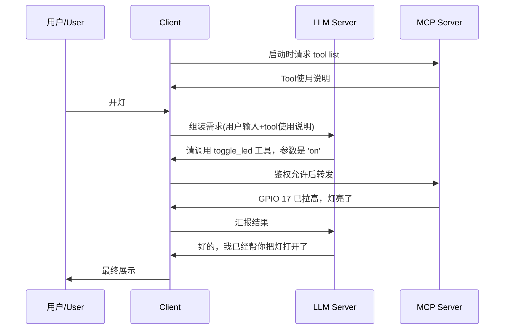

# AI Client：User、LLM server 与 MCP server 之间的调度中心

Client（客户端/宿主程序）在这个架构中，扮演“枢纽”或“调度中心”的角色。

为便于理解该“调度中心”的工作流，以下以“打开树莓派 LED”的任务作为示例，说明其具体调度内容。

## 流程图

## 1. 调度内容与流程

Client 不仅负责调度，还承担信息整理与组装的工作。示例流程如下。

### 启动阶段：获取工具列表 (Client -> MCP)

- 来源：Client 启动后发起 tool list 请求。
- Client 的动作：向 MCP Server 请求工具清单。
- MCP Server 的动作：返回工具使用说明（例如 “我有 toggle_led 工具”）。

### 第一阶段：组装需求 (Client -> LLM)

- 来源：用户说的话（“开灯”）+ MCP Server 提供的工具使用说明。
- Client 的动作：将上述信息打包发送给远端 LLM Server，请求生成下一步操作指令。

### 第二阶段：拦截指令 (LLM -> Client -> MCP)

- 来源：LLM 的回复（“请调用 toggle_led 工具，参数是 'on'”）。
- Client 的动作：
	1. 拦截：Client 识别这不是给用户看的普通对话，而是一个操作请求。
	2. 鉴权（关键）：Client 可能弹出提示框询问：“Claude 想要操作用户的树莓派，允许吗？”（用于权限确认）。
	3. 转发：用户点击允许后，Client 将指令转成 MCP 协议，发给树莓派上的 MCP Server。

### 第三阶段：汇报结果 (MCP -> Client -> LLM)

- 来源：树莓派执行完代码，返回结果（“GPIO 17 已拉高，灯亮了”）。
- Client 的动作：将该执行结果打包，发回给 LLM，请求生成面向用户的回复。

### 第四阶段：最终展示 (LLM -> Client -> 用户)

- 来源：LLM 根据执行结果生成的自然语言（“好的，我已经帮你把灯打开了”）。
- Client 的动作：把这句话显示在你的屏幕上。

## 2. 为什么需要这个中间环节

既然只是转发，为什么 LLM 不直接连树莓派？Client 存在的意义有两点：

1. 安全隔离 (Security)
	 - LLM 运行在云端（比如 Anthropic 的服务器），用户不希望云端服务器直接连入用户家里的局域网。
	 - Client 运行在用户本地电脑上，它是唯一能同时接触到“外网 LLM”和“内网树莓派”的组件，负责隔离与转发。

2. 状态管理 (State)
	 - LLM 本身是无状态的。Client 负责保存用户的聊天记录（History），每次转发时，都要把之前的上下文带上，这样 LLM 才能基于上下文生成回复。

## 总结

- LLM Server 负责生成回复与工具调用建议。
- MCP Server 负责执行具体工具操作。
- 用户 (User) 发出指令。
- Client 负责调度、鉴权与信息转发。
