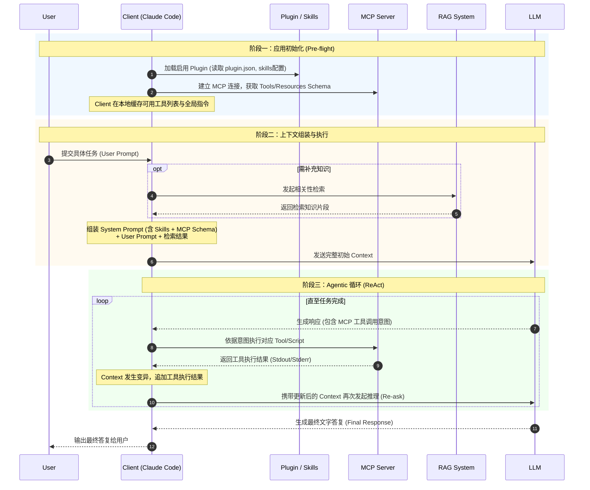

# LLM Context、Prompt、RAG、MCP、Skills、Plugin 关系说明

## 术语表

| 中文术语 | 英文术语 | 一句话说明 |
| --- | --- | --- |
| 上下文 | Context | 模型在当前回合可见并可利用的全部输入信息集合（工作记忆区）。 |
| 提示词 | Prompt | 用于定义任务目标、约束和输出格式的指令文本，分为系统提示和用户提示。 |
| 检索增强生成 | RAG | Retrieval-Augmented Generation 先从外部知识源检索信息，再将结果注入上下文后生成答复。 |
| 模型上下文协议 | MCP | Model Context Protocol 连接并调用外部工具与数据源的标准化 C/S 架构协议层。 |
| 技能 | Skills | 面向特定任务的可复用流程与规则封装，可附带脚本和资源。 |
| 插件 | Plugin | 在 Claude Code 等客户端中，用于打包组合 skills/agents/hooks/MCP 等能力的可共享扩展单元。 |

---

## 1. 架构分层视角

为了更清晰地理解这些概念，我们可以将其映射到现代 LLM 应用的基础架构层：

* **运行时核心层 (Runtime Core)**：包含 **Context** 与 **Prompt**。这是大语言模型直接读取、处理和依赖的基础工作区。所有外部能力最终都必须转化为这一层的文本/Token 才能生效。
* **能力增强与连接层 (Augmentation & Connection)**：包含 **RAG** 与 **MCP**。这是打通封闭模型与外部世界（知识、实时数据、系统操作）的数据与执行通道。
* **工程封装与组织层 (Packaging & Orchestration)**：包含 **Skills** 与 **Plugin**。这是为了逻辑复用、团队分发和复杂流程控制而设计的工程结构。

---

## 2. 核心概念详解

### 2.1 运行时核心层

**Context（上下文）**
Context 是 LLM 在当前推理回合中可见的全部输入，可视作模型的**当前工作记忆区**。在多轮对话或 Agentic 循环（如 ReAct 推理-行动循环）中，Context 并非简单的静态累加，而是一个**动态滑动窗口**。每次工具执行返回结果后，Context 的状态都会发生变异（Mutation），引发 LLM 的重新推理。

**Prompt（提示词）**
Prompt 是定义任务目标与约束的指令，是 Context 的最核心组成部分。在工程实现上，通常严格区分为两类：

* **System Prompt（系统提示词）**：通常是静态或半静态的，包含全局规则、人设、可用工具的 Schema（如 MCP 提供的工具签名）以及 Skills 的全局约束。
* **User Prompt（用户提示词）**：驱动当前具体回合的意图与任务目标。

### 2.2 能力增强与连接层

**RAG（Retrieval-Augmented Generation）**
RAG 是“先检索、后生成”的工作方式，主要用于补充知识内容、提升事实一致性并降低幻觉。检索到的外部信息会被直接注入到 Context 中。

**MCP（Model Context Protocol）**
MCP 是模型与外部工具/数据源交互的标准化协议层，采用 **Host/Client（如 Claude Code）与 Server（外部工具链） 的 C/S 架构**。MCP 本身不是数据源，而是提供连接通道。它包含三大核心原语：

1. **Resources（资源）**：提供类似文件系统的只读数据（如本地日志、实时 API 状态），直接注入 Context。
2. **Tools（工具）**：提供可执行的函数（带有副作用，如运行脚本、写文件），LLM 通过输出参数意图来触发执行。
3. **Prompts（提示模板）**：Server 侧预定义的指令模板，便于复用复杂的外部指令。

### 2.3 工程封装与组织层

**Skills（技能）**
Skills 是可复用的任务方法包，用于提供稳定的流程与执行约束。它通常以文件目录的形式组织（如 `SKILL.md` 包含指令，`scripts/` 包含脚本，`assets/` 包含模板），最终其指令部分会被注入 System Prompt，而脚本部分可通过 MCP 等机制被 LLM 调用。

**Plugin（插件）**
Plugin（以 Claude Code 为例）是能力的**打包与分发层**。它通过一份清单文件（如 `plugin.json`）将上述的 `.mcp.json`（外部连接）、`skills/`（流程约束）、`hooks/`（生命周期钩子）组合成一个可共享的扩展单元，解决命名空间管理与可发现性问题。

---

## 3. 实际执行时序图

相较于传统的单次调用，现代大模型客户端的实际执行周期包含了前置初始化与工具调用的循环机制。

