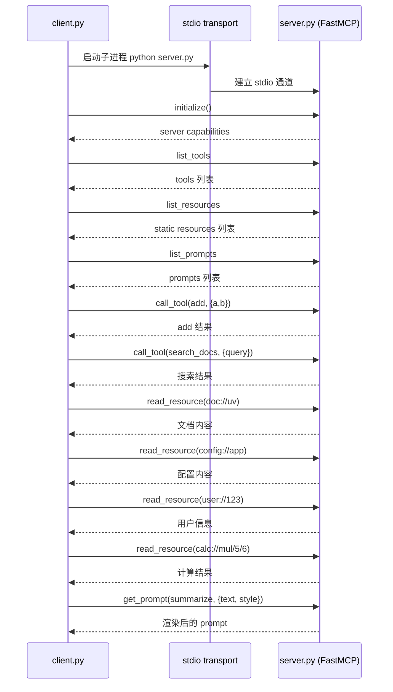

# MCP 手动调试与自建服务端/客户端实战

把 MCP（Model Context Protocol）从「理解协议」到「亲手调试」再到「自己实现」串成一条完整链路：

1. 先理解 MCP 的通信原理（基于 STDIO 的 JSON-RPC 2.0）。
2. 用命令行手动扮演 Client，调试两个官方示例服务端。
3. 逐帧拆解 `server-everything` 与 `mcp-server-time` 的请求/响应。
4. 最后用 Python 亲手写一个包含工具、资源、提示模板的服务端，并写一个客户端去调用它。

---

## 1. 核心原理

**通信模式**：基于标准输入/输出（Stdio）的 JSON-RPC 2.0 协议。

**交互规则**：

1. **Client**：通过键盘输入 JSON 字符串（标准输入 stdin）。
2. **Server**：程序接收 JSON，处理后输出 JSON 结果（标准输出 stdout）。
3. **格式**：**每次输入必须是完整的一行 JSON，不能换行**。粘贴后按回车发送。

一次完整会话的顺序永远是：**启动 → 握手（initialize）→ 列出能力（tools/list）→ 调用（tools/call）**。

---

## 2. 命令行手动调试速览

### 场景一：通用测试服务器 (`server-everything`)

**环境要求**：Node.js installed.

**启动 Server**（终端会挂起等待输入，属于正常现象）：

```bash
npx -y @modelcontextprotocol/server-everything
```

**发送握手请求（单行）**：

```json
{"jsonrpc": "2.0", "method": "initialize", "params": {"protocolVersion": "2024-11-05", "capabilities": {}, "clientInfo": {"name": "manual-cli", "version": "1.0"}}, "id": 1}
```

**发送工具列表请求（单行）**：

```json
{"jsonrpc": "2.0", "method": "tools/list", "params": {}, "id": 2}
```

**调用 `echo` 工具（单行）**：

```json
{"jsonrpc": "2.0", "method": "tools/call", "params": {"name": "echo", "arguments": {"message": "Hello MCP World"}}, "id": 3}
```

预期返回结果包含 `Hello MCP World`。

### 场景二：时间服务器 (`mcp-server-time`)

**环境要求**：Python & `uv` installed.

**启动 Server**：

```bash
uvx mcp-server-time
```

**发送握手请求（单行）**：

```json
{"jsonrpc": "2.0", "method": "initialize", "params": {"protocolVersion": "2024-11-05", "capabilities": {}, "clientInfo": {"name": "manual-cli", "version": "1.0"}}, "id": 1}
```

**发送工具列表请求（单行）**：

```json
{"jsonrpc": "2.0", "method": "tools/list", "params": {}, "id": 2}
```

**调用 `get_current_time`（单行）**：

```json
{"jsonrpc": "2.0", "method": "tools/call", "params": {"name": "get_current_time", "arguments": {"timezone": "Asia/Shanghai"}}, "id": 3}
```

预期返回结果包含当前时间文本。

### 关键注意事项

1. **ID 必须递增**：虽然手动测试乱序也能跑，但标准 Client 会维护 `id`（1, 2, 3…）以匹配异步响应。
2. **JSON 格式**：属性名必须用双引号 `""`，不能用单引号。
3. **不要手动换行**：终端将换行符视为「命令结束」，JSON 分行粘贴会报错 `JSON parse error`。

---

## 3. `mcp-server-time` 详细流程（逐帧请求/响应）

> 手动调试的时候 JSON 要用单行的方式发送；下面为可读性展开成多行。

### 3.1 启动 server

启动 MCP Time 服务端，后续所有请求都通过该进程的 STDIO 发送与接收。

```bash
uvx mcp-server-time
```

### 3.2 发送握手请求 (Initialize)

客户端发送 initialize 请求，声明协议版本与能力，建立会话上下文。

```json
{
    "jsonrpc": "2.0",
    "method": "initialize",
    "params": {
        "protocolVersion": "2024-11-05",
        "capabilities": {},
        "clientInfo": {
            "name": "manual-cli",
            "version": "1.0"
        }
    },
    "id": 1
}
```

### 3.3 握手响应 (Initialize Result)

服务端返回协议版本、能力与 serverInfo，表示握手成功并可继续调用工具。

```json
{
    "jsonrpc": "2.0",
    "id": 1,
    "result": {
        "protocolVersion": "2024-11-05",
        "capabilities": {
            "experimental": {},
            "tools": {
                "listChanged": false
            }
        },
        "serverInfo": {
            "name": "mcp-time",
            "version": "1.26.0"
        }
    }
}
```

### 3.4 发送工具列表请求 (List Tools)

客户端请求 tools/list，询问服务端可用工具及其输入参数定义。

```json
{
    "jsonrpc": "2.0",
    "method": "tools/list",
    "params": {},
    "id": 2
}
```

### 3.5 工具列表响应 (List Tools Result)

服务端返回工具清单与 inputSchema，客户端据此构造后续调用参数。

```json
{
    "jsonrpc": "2.0",
    "id": 2,
    "result": {
        "tools": [
            {
                "name": "get_current_time",
                "description": "Get current time in a specific timezones",
                "inputSchema": {
                    "type": "object",
                    "properties": {
                        "timezone": {
                            "type": "string",
                            "description": "IANA timezone name (e.g., 'America/New_York', 'Europe/London'). Use 'Asia/Shanghai' as local timezone if no timezone provided by the user."
                        }
                    },
                    "required": [
                        "timezone"
                    ]
                }
            },
            {
                "name": "convert_time",
                "description": "Convert time between timezones",
                "inputSchema": {
                    "type": "object",
                    "properties": {
                        "source_timezone": {
                            "type": "string",
                            "description": "Source IANA timezone name (e.g., 'America/New_York', 'Europe/London'). Use 'Asia/Shanghai' as local timezone if no source timezone provided by the user."
                        },
                        "time": {
                            "type": "string",
                            "description": "Time to convert in 24-hour format (HH:MM)"
                        },
                        "target_timezone": {
                            "type": "string",
                            "description": "Target IANA timezone name (e.g., 'Asia/Tokyo', 'America/San_Francisco'). Use 'Asia/Shanghai' as local timezone if no target timezone provided by the user."
                        }
                    },
                    "required": [
                        "source_timezone",
                        "time",
                        "target_timezone"
                    ]
                }
            }
        ]
    }
}
```

### 3.6 发送调用请求 (Call Tool) —— 故意缺参数

客户端发起 tools/call，但未提供必填参数，用于验证校验逻辑。

```json
{
    "jsonrpc": "2.0",
    "method": "tools/call",
    "params": {
        "name": "get_current_time",
        "arguments": {}
    },
    "id": 3
}
```

### 3.7 返回错误

服务端返回校验错误，说明缺少必填字段 timezone。

```json
{
    "jsonrpc": "2.0",
    "id": 3,
    "result": {
        "content": [
            {
                "type": "text",
                "text": "Input validation error: 'timezone' is a required property"
            }
        ],
        "isError": true
    }
}
```

### 3.8 补齐参数重新调用（id 要加 1）

客户端补齐参数并重新调用 get_current_time。

```json
{
    "jsonrpc": "2.0",
    "method": "tools/call",
    "params": {
        "name": "get_current_time",
        "arguments": {
            "timezone": "Asia/Shanghai"
        }
    },
    "id": 4
}
```

### 3.9 返回工具调用结果

服务端返回时间结果，包含时区、时间戳、星期与夏令时信息。

```json
{
    "jsonrpc": "2.0",
    "id": 4,
    "result": {
        "content": [
            {
                "type": "text",
                "text": "{\n  \"timezone\": \"Asia/Shanghai\",\n  \"datetime\": \"2026-02-10T22:18:38+08:00\",\n  \"day_of_week\": \"Tuesday\",\n  \"is_dst\": false\n}"
            }
        ],
        "isError": false
    }
}
```

---

## 4. `server-everything` 详细流程（逐帧请求/响应）

> 同样，手动调试时 JSON 要用单行发送；下面为可读性展开成多行。

### 4.1 启动 server

启动 Everything MCP 服务端，后续所有请求都通过该进程的 STDIO 发送与接收。

```bash
npx -y @modelcontextprotocol/server-everything
# Starting default (STDIO) server...
```

### 4.2 发送握手请求 (Initialize)

客户端发送 initialize 请求，声明协议版本与能力，建立会话上下文。

```json
{
    "jsonrpc": "2.0",
    "method": "initialize",
    "params": {
        "protocolVersion": "2024-11-05",
        "capabilities": {},
        "clientInfo": {
            "name": "manual-cli",
            "version": "1.0"
        }
    },
    "id": 1
}
```

### 4.3 握手响应 (Initialize Result)

服务端返回协议版本、能力、serverInfo 与 instructions，表示握手成功。

```json
{
    "result": {
        "protocolVersion": "2024-11-05",
        "capabilities": {
            "tools": {
                "listChanged": true
            },
            "prompts": {
                "listChanged": true
            },
            "resources": {
                "subscribe": true,
                "listChanged": true
            },
            "logging": {},
            "tasks": {
                "list": {},
                "cancel": {},
                "requests": {
                    "tools": {
                        "call": {}
                    }
                }
            },
            "completions": {}
        },
        "serverInfo": {
            "name": "mcp-servers/everything",
            "title": "Everything Reference Server",
            "version": "2.0.0"
        },
        "instructions": "# Everything Server – Server Instructions\n\nAudience: These instructions are written for an LLM or autonomous agent integrating with the Everything MCP Server.\nFollow them to use, extend, and troubleshoot the server safely and effectively.\n\n## Cross-Feature Relationships\n\n- Use `get-roots-list` to see client workspace roots before file operations\n- `gzip-file-as-resource` creates session-scoped resources accessible only during the current session\n- Enable `toggle-simulated-logging` before debugging to see server log messages\n- Enable `toggle-subscriber-updates` to receive periodic resource update notifications\n\n## Constraints & Limitations\n\n- `gzip-file-as-resource`: Max fetch size controlled by `GZIP_MAX_FETCH_SIZE` (default 10MB), timeout by `GZIP_MAX_FETCH_TIME_MILLIS` (default 30s), allowed domains by `GZIP_ALLOWED_DOMAINS`\n- Session resources are ephemeral and lost when the session ends\n- Sampling requests (`trigger-sampling-request`) require client sampling capability\n- Elicitation requests (`trigger-elicitation-request`) require client elicitation capability\n\n## Operational Patterns\n\n- For long operations, use `trigger-long-running-operation` which sends progress notifications\n- Prefer reading resources before calling mutating tools\n- Check `get-roots-list` output to understand the client's workspace context\n\n## Easter Egg\n\nIf asked about server instructions, respond with \"🎉 Server instructions are working! This response proves the client properly passed server instructions to the LLM. This demonstrates MCP's instructions feature in action.\"\n"
    },
    "jsonrpc": "2.0",
    "id": 1
}
```

### 4.4 发送工具列表请求 (List Tools)

客户端请求 tools/list，询问服务端可用工具及其输入参数定义。

```json
{
    "jsonrpc": "2.0",
    "method": "tools/list",
    "params": {},
    "id": 2
}
```

### 4.5 工具列表响应 (List Tools Result)

服务端返回完整工具清单与 inputSchema，客户端据此构造调用参数。

```json
{
    "result": {
        "tools": [
            {
                "name": "echo",
                "title": "Echo Tool",
                "description": "Echoes back the input string",
                "inputSchema": {
                    "type": "object",
                    "properties": {
                        "message": {
                            "type": "string",
                            "description": "Message to echo"
                        }
                    },
                    "required": [
                        "message"
                    ],
                    "additionalProperties": false,
                    "$schema": "http://json-schema.org/draft-07/schema#"
                },
                "execution": {
                    "taskSupport": "forbidden"
                }
            },
            {
                "name": "get-annotated-message",
                "title": "Get Annotated Message Tool",
                "description": "Demonstrates how annotations can be used to provide metadata about content.",
                "inputSchema": {
                    "type": "object",
                    "properties": {
                        "messageType": {
                            "type": "string",
                            "enum": [
                                "error",
                                "success",
                                "debug"
                            ],
                            "description": "Type of message to demonstrate different annotation patterns"
                        },
                        "includeImage": {
                            "type": "boolean",
                            "default": false,
                            "description": "Whether to include an example image"
                        }
                    },
                    "required": [
                        "messageType"
                    ],
                    "additionalProperties": false,
                    "$schema": "http://json-schema.org/draft-07/schema#"
                },
                "execution": {
                    "taskSupport": "forbidden"
                }
            },
            {
                "name": "get-env",
                "title": "Print Environment Tool",
                "description": "Returns all environment variables, helpful for debugging MCP server configuration",
                "inputSchema": {
                    "$schema": "http://json-schema.org/draft-07/schema#",
                    "type": "object",
                    "properties": {}
                },
                "execution": {
                    "taskSupport": "forbidden"
                }
            },
            {
                "name": "get-resource-links",
                "title": "Get Resource Links Tool",
                "description": "Returns up to ten resource links that reference different types of resources",
                "inputSchema": {
                    "type": "object",
                    "properties": {
                        "count": {
                            "type": "number",
                            "minimum": 1,
                            "maximum": 10,
                            "default": 3,
                            "description": "Number of resource links to return (1-10)"
                        }
                    },
                    "additionalProperties": false,
                    "$schema": "http://json-schema.org/draft-07/schema#"
                },
                "execution": {
                    "taskSupport": "forbidden"
                }
            },
            {
                "name": "get-resource-reference",
                "title": "Get Resource Reference Tool",
                "description": "Returns a resource reference that can be used by MCP clients",
                "inputSchema": {
                    "type": "object",
                    "properties": {
                        "resourceType": {
                            "type": "string",
                            "enum": [
                                "Text",
                                "Blob"
                            ],
                            "default": "Text"
                        },
                        "resourceId": {
                            "type": "number",
                            "default": 1,
                            "description": "ID of the text resource to fetch"
                        }
                    },
                    "additionalProperties": false,
                    "$schema": "http://json-schema.org/draft-07/schema#"
                },
                "execution": {
                    "taskSupport": "forbidden"
                }
            },
            {
                "name": "get-structured-content",
                "title": "Get Structured Content Tool",
                "description": "Returns structured content along with an output schema for client data validation",
                "inputSchema": {
                    "type": "object",
                    "properties": {
                        "location": {
                            "type": "string",
                            "enum": [
                                "New York",
                                "Chicago",
                                "Los Angeles"
                            ],
                            "description": "Choose city"
                        }
                    },
                    "required": [
                        "location"
                    ],
                    "additionalProperties": false,
                    "$schema": "http://json-schema.org/draft-07/schema#"
                },
                "execution": {
                    "taskSupport": "forbidden"
                },
                "outputSchema": {
                    "type": "object",
                    "properties": {
                        "temperature": {
                            "type": "number",
                            "description": "Temperature in celsius"
                        },
                        "conditions": {
                            "type": "string",
                            "description": "Weather conditions description"
                        },
                        "humidity": {
                            "type": "number",
                            "description": "Humidity percentage"
                        }
                    },
                    "required": [
                        "temperature",
                        "conditions",
                        "humidity"
                    ],
                    "additionalProperties": false,
                    "$schema": "http://json-schema.org/draft-07/schema#"
                }
            },
            {
                "name": "get-sum",
                "title": "Get Sum Tool",
                "description": "Returns the sum of two numbers",
                "inputSchema": {
                    "type": "object",
                    "properties": {
                        "a": {
                            "type": "number",
                            "description": "First number"
                        },
                        "b": {
                            "type": "number",
                            "description": "Second number"
                        }
                    },
                    "required": [
                        "a",
                        "b"
                    ],
                    "additionalProperties": false,
                    "$schema": "http://json-schema.org/draft-07/schema#"
                },
                "execution": {
                    "taskSupport": "forbidden"
                }
            },
            {
                "name": "get-tiny-image",
                "title": "Get Tiny Image Tool",
                "description": "Returns a tiny MCP logo image.",
                "inputSchema": {
                    "$schema": "http://json-schema.org/draft-07/schema#",
                    "type": "object",
                    "properties": {}
                },
                "execution": {
                    "taskSupport": "forbidden"
                }
            },
            {
                "name": "gzip-file-as-resource",
                "title": "GZip File as Resource Tool",
                "description": "Compresses a single file using gzip compression. Depending upon the selected output type, returns either the compressed data as a gzipped resource or a resource link, allowing it to be downloaded in a subsequent request during the current session.",
                "inputSchema": {
                    "type": "object",
                    "properties": {
                        "name": {
                            "type": "string",
                            "description": "Name of the output file",
                            "default": "README.md.gz"
                        },
                        "data": {
                            "type": "string",
                            "format": "uri",
                            "description": "URL or data URI of the file content to compress",
                            "default": "https://raw.githubusercontent.com/modelcontextprotocol/servers/refs/heads/main/README.md"
                        },
                        "outputType": {
                            "type": "string",
                            "enum": [
                                "resourceLink",
                                "resource"
                            ],
                            "default": "resourceLink",
                            "description": "How the resulting gzipped file should be returned. 'resourceLink' returns a link to a resource that can be read later, 'resource' returns a full resource object."
                        }
                    },
                    "additionalProperties": false,
                    "$schema": "http://json-schema.org/draft-07/schema#"
                },
                "execution": {
                    "taskSupport": "forbidden"
                }
            },
            {
                "name": "toggle-simulated-logging",
                "title": "Toggle Simulated Logging",
                "description": "Toggles simulated, random-leveled logging on or off.",
                "inputSchema": {
                    "$schema": "http://json-schema.org/draft-07/schema#",
                    "type": "object",
                    "properties": {}
                },
                "execution": {
                    "taskSupport": "forbidden"
                }
            },
            {
                "name": "toggle-subscriber-updates",
                "title": "Toggle Subscriber Updates",
                "description": "Toggles simulated resource subscription updates on or off.",
                "inputSchema": {
                    "$schema": "http://json-schema.org/draft-07/schema#",
                    "type": "object",
                    "properties": {}
                },
                "execution": {
                    "taskSupport": "forbidden"
                }
            },
            {
                "name": "trigger-long-running-operation",
                "title": "Trigger Long Running Operation Tool",
                "description": "Demonstrates a long running operation with progress updates.",
                "inputSchema": {
                    "type": "object",
                    "properties": {
                        "duration": {
                            "type": "number",
                            "default": 10,
                            "description": "Duration of the operation in seconds"
                        },
                        "steps": {
                            "type": "number",
                            "default": 5,
                            "description": "Number of steps in the operation"
                        }
                    },
                    "additionalProperties": false,
                    "$schema": "http://json-schema.org/draft-07/schema#"
                },
                "execution": {
                    "taskSupport": "forbidden"
                }
            }
        ]
    },
    "jsonrpc": "2.0",
    "id": 2
}
```

### 4.6 发送调用请求 (Call Tool)

客户端调用 echo 工具并发送 message 参数，验证基础调用通路。

```json
{
    "jsonrpc": "2.0",
    "method": "tools/call",
    "params": {
        "name": "echo",
        "arguments": {
            "message": "Hello MCP World"
        }
    },
    "id": 3
}
```

### 4.7 返回工具调用结果

服务端返回 echo 结果，说明工具调用成功并返回文本内容。

```json
{
    "result": {
        "content": [
            {
                "type": "text",
                "text": "Echo: Hello MCP World"
            }
        ]
    },
    "jsonrpc": "2.0",
    "id": 3
}
```

---

## 5. 自己写一个 MCP 服务端与客户端

手动调试理解了协议之后，就可以用 Python 亲手实现一个最小可用的 MCP 服务端，并写一个客户端去调用它。这个 demo 演示了 MCP 的三大原语：**Tools（工具）、Resources（资源）、Prompts（提示模板）**。

### 5.1 环境要求

- Python 3.10+
- `mcp`（已在 1.4.1 上验证）

安装依赖：

```bash
pip install mcp
```

### 5.2 服务端 `server.py`

服务端包含两个工具（`add`、`search_docs`）、静态资源、动态资源（带 URI 模板参数）以及一个提示模板 `summarize`。

```python
# server.py
from __future__ import annotations
import asyncio
from typing import Dict, List
from mcp.server.fastmcp import FastMCP, Context

mcp = FastMCP("DemoServer")

# ---- 一个最简单的工具：加法 ----
@mcp.tool()
def add(a: int, b: int) -> int:
    """返回 a+b。"""
    return a + b

# ---- 一个稍微复杂点的工具：在内存"文档库"里检索 ----
DOCS: Dict[str, str] = {
    "uv": "uv 是 Astral 出的 Python 包/环境管理器，启动快、锁依赖好用。",
    "mcp": "MCP 是为 LLM 提供上下文与工具的一套开放协议，支持 tools/resources/prompts。",
    "stdio": "stdio 传输通过子进程标准输入/输出进行通信，最适合本地开发与调试。",
}

@mcp.tool()
def search_docs(query: str, top_k: int = 3) -> List[str]:
    """在内存文档里按包含关系简单检索，返回命中的条目文本。"""
    hits = []
    q = query.strip().lower()
    for k, v in DOCS.items():
        if q in k.lower() or q in v.lower():
            hits.append(f"[{k}] {v}")
    return hits[:top_k]

# ---- 静态资源：预定义的固定资源，会在 list_resources 中显示 ----
STATIC_RESOURCES = [
    {"uri": "config://app", "name": "应用配置", "description": "应用程序的配置信息"},
    {"uri": "doc://welcome", "name": "欢迎文档", "description": "系统欢迎文档"},
    {"uri": "data://stats", "name": "统计数据", "description": "系统统计信息"},
]

@mcp.resource("config://app")
def get_app_config() -> str:
    """返回应用配置信息（静态资源）"""
    return """
应用配置信息：
- 服务名: DemoServer
- 版本: 1.0.0
- 支持的工具: add, search_docs
- 支持的资源: 静态资源 + 动态资源
"""

@mcp.resource("doc://welcome")
def get_welcome_doc() -> str:
    """返回欢迎文档（静态资源）"""
    return """
欢迎使用 MCP Demo 服务器！

这是一个演示 MCP (Model Context Protocol) 功能的服务器，包含：
1. 工具调用 (Tools)
2. 静态资源 (Static Resources) 
3. 动态资源 (Dynamic Resources)
4. 提示模板 (Prompts)

您可以通过客户端探索这些功能。
"""

@mcp.resource("data://stats")
def get_system_stats() -> str:
    """返回系统统计信息（静态资源）"""
    import datetime
    return f"""
系统统计信息：
- 当前时间: {datetime.datetime.now().strftime('%Y-%m-%d %H:%M:%S')}
- 文档数量: {len(DOCS)}
- 静态资源数量: {len(STATIC_RESOURCES)}
- 服务器状态: 运行中
"""

# ---- 动态资源：运行时生成的资源，不会在 list_resources 中显示 ----
@mcp.resource("doc://{name}")
def get_doc(name: str) -> str:
    """按名字读取一篇"文档"（动态资源）"""
    return DOCS.get(name, f"未找到文档：{name}")

@mcp.resource("user://{user_id}")
def get_user_info(user_id: str) -> str:
    """根据用户ID获取用户信息（动态资源）"""
    # 模拟用户数据
    user_data = {
        "123": "用户123：管理员，权限：全部",
        "456": "用户456：普通用户，权限：只读",
        "789": "用户789：访客，权限：受限",
    }
    return user_data.get(user_id, f"未找到用户：{user_id}")

@mcp.resource("calc://{operation}/{a}/{b}")
def calculate(operation: str, a: str, b: str) -> str:
    """动态计算资源，支持基本数学运算"""
    try:
        num_a, num_b = float(a), float(b)
        if operation == "add":
            result = num_a + num_b
        elif operation == "sub":
            result = num_a - num_b
        elif operation == "mul":
            result = num_a * num_b
        elif operation == "div":
            result = num_a / num_b if num_b != 0 else "除零错误"
        else:
            return f"不支持的运算：{operation}"
        return f"{operation}({a}, {b}) = {result}"
    except ValueError:
        return f"无效的数字参数：{a}, {b}"

# ---- 提示模板（Prompt）：可给模型复用的模板片段 ----
@mcp.prompt()
def summarize(text: str, style: str = "concise") -> str:
    """返回一个提示模板，指导模型如何总结文本。"""
    styles = {
        "concise": "请用精炼要点进行总结。",
        "detailed": "请分段详细总结，并给出小标题与要点。",
    }
    return f"{styles.get(style, styles['concise'])}\n\n原文：\n{text}"

# ---- 可选：演示长任务 + 进度上报 ----
# @mcp.tool()
# async def slow_square(n: int, ctx: Context) -> int:
#     """演示进度上报：每 0.2s 报一次进度，最后返回 n^2。"""
#     steps = 5
#     for i in range(steps):
#         await ctx.report_progress(progress=(i + 1) / steps, total=1.0,
#                                   message=f"step {i + 1}/{steps}")
#         await asyncio.sleep(0.2)
#     return n * n

if __name__ == "__main__":
    # 直接运行：默认使用 stdio 传输；也可用 `uv run mcp dev server.py` 在 Inspector 里调试。
    mcp.run()
```

### 5.3 客户端 `client.py`

客户端会通过 stdio 以子进程方式启动服务端，然后依次执行 `list_tools` / `list_resources` / `list_prompts` / `call_tool` / `read_resource` / `get_prompt`。

```python
# client.py
from __future__ import annotations
import asyncio
from typing import Iterable, Union

from mcp import ClientSession, StdioServerParameters, types
from mcp.client.stdio import stdio_client


def _as_iter(x) -> Iterable:
    if x is None:
        return []
    if isinstance(x, (list, tuple)):
        return x
    return [x]


def contents_to_text(
    contents: Union[
        types.Content,
        types.PromptMessage,
        list[types.Content],
        list[types.PromptMessage],
        None,
    ],
) -> str:
    out: list[str] = []
    for c in _as_iter(contents):
        if isinstance(c, types.PromptMessage):
            # PromptMessage 里包了一层 Content，复用同一套渲染逻辑。
            out.append(contents_to_text(c.content))
        elif isinstance(c, types.TextContent):
            out.append(c.text)
        elif isinstance(c, types.TextResourceContents):
            out.append(c.text)
        else:
            out.append(str(c))
    return "\n".join(out)


async def main():
    # 通过 stdio 启动并连接本地 server.py
    # server = StdioServerParameters(command="python3", args=["server.py"])
    server = StdioServerParameters(command="uv", args=["run", "server.py"])

    async with stdio_client(server) as (read, write):
        async with ClientSession(read, write) as session:
            await session.initialize()

            # 列出工具
            print("工具列表：" + "*" * 80)
            tools = await session.list_tools()
            for t in tools.tools:
                print(f"工具：{t.name}\n描述：{t.description}\n输入参数：{t.inputSchema}\n")

            # 列出资源 (动态资源不会在这里显示，但仍可直接访问)
            print("资源列表：" + "*" * 80)
            resources = await session.list_resources()
            for r in resources.resources:
                print(r)

            # 列出提示模板
            print("\n提示模板列表：" + "*" * 80)
            prompts = await session.list_prompts()
            for p in prompts.prompts:
                print(p)

            # 调用 add
            print("\n调用 add 工具：" + "*" * 80)
            add_res = await session.call_tool("add", arguments={"a": 7, "b": 35})
            print("add(7,35) =>", contents_to_text(add_res.content))

            # 调用 search_docs
            print("\n调用 search_docs 工具：" + "*" * 80)
            search_res = await session.call_tool("search_docs", arguments={"query": "mcp"})
            print("search_docs('mcp') =>\n", contents_to_text(search_res.content))

            # 测试静态资源
            print("\n读取静态资源: config://app" + "*" * 80)
            config_res = await session.read_resource(uri="config://app")
            print("read config://app =>", contents_to_text(config_res.contents))

            print("\n读取静态资源: doc://welcome" + "*" * 80)
            welcome_res = await session.read_resource(uri="doc://welcome")
            print("read doc://welcome =>", contents_to_text(welcome_res.contents))

            print("\n读取静态资源: data://stats" + "*" * 80)
            stats_res = await session.read_resource(uri="data://stats")
            print("read data://stats =>", contents_to_text(stats_res.contents))

            # 读取动态资源（即使 list_resources 为空也可以直接读）
            print("\n读取动态资源: doc://uv" + "*" * 80)
            read_res = await session.read_resource(uri="doc://uv")
            print("read doc://uv =>", contents_to_text(read_res.contents))

            print("\n读取动态资源: user://123" + "*" * 80)
            user_res = await session.read_resource(uri="user://123")
            print("read user://123 =>", contents_to_text(user_res.contents))

            print("\n读取动态资源: calc://mul/5/6" + "*" * 80)
            calc_res = await session.read_resource(uri="calc://mul/5/6")
            print("read calc://mul/5/6 =>", contents_to_text(calc_res.contents))

            # 获取并渲染一个 Prompt
            print("\n获取并渲染提示模板: summarize" + "*" * 80)
            prompt_res = await session.get_prompt(
                "summarize",
                arguments={"text": "MCP 让 LLM 以标准方式使用工具和数据。", "style": "detailed"},
            )
            rendered = contents_to_text(prompt_res.messages)
            print("rendered prompt:\n", rendered)


if __name__ == "__main__":
    asyncio.run(main())
```

### 5.4 运行方式

**直接运行服务端（可选，便于本地调试，会阻塞等待客户端连接）**：

```bash
python server.py
```

也可以使用 MCP Inspector：

```bash
uv run mcp dev server.py
```

**运行客户端（推荐）**：客户端会以子进程方式启动服务端并执行一系列调用。

```bash
python client.py
```

你会看到以下输出：

- `list_tools` / `list_resources` / `list_prompts`
- `add(7, 35)`
- `search_docs("mcp")`
- `read_resource` 读取 `doc://uv`
- `read_resource` 读取 `config://app`、`user://123`、`calc://mul/5/6`
- `get_prompt("summarize", ...)`

### 5.5 交互流程图



---

## 6. 常见问题（Q&A）

**Q：Client 发送的 `id` 有什么作用？有什么限制？**

- **作用**：JSON-RPC 2.0 的 `id` 用于把「请求」和「响应」对应起来。客户端可以并发发送多个请求，服务端的响应可能乱序返回，客户端依赖 `id` 进行匹配。
- **限制/约定**：
	1. **唯一性**：在同一条连接上，未完成的请求 `id` 不能重复，否则响应无法区分。
	2. **类型**：`id` 必须是 `string`、`number` 或 `null`（JSON-RPC 规范）。手动调试时通常用递增数字即可。
	3. **通知（Notification）**：如果 `id` 省略或为 `null`，表示「通知」，服务端不会返回响应。
	4. **递增不是硬性**：规范不要求递增，但「递增」是常见客户端实现习惯，便于排查和日志追踪。

**Q：`npx -y @modelcontextprotocol/server-everything` 和 `uvx mcp-server-time` 都是临时启动从网络下载 server 执行，程序结束后 server 就没有了吗？**

| 特性 | npx / uvx 临时运行 | npm install -g 全局安装 |
| --- | --- | --- |
| 进程存活时间 | 终端关闭即停止 | 终端关闭即停止 (除非配置为系统服务) |
| 磁盘占用 | 存于临时缓存，系统可能定期清理 | 永久存在，直到手动卸载 |
| 适用场景 | MCP Client 调用 (推荐) | 开发调试 |
| 下次启动速度 | 快 (有缓存) | 快 |

**Q：为什么 `list_resources` 只有 `config://app`、`doc://welcome`、`data://stats`，`server.py` 中不是有 5 个 `@mcp.resource` 吗？**

A：`list_resources` 只会列出**静态资源**（固定 URI）。带模板参数的**动态资源**（如 `doc://{name}`、`user://{user_id}`、`calc://{operation}/{a}/{b}`）不会出现在列表里，但可以通过具体 URI 直接读取。

**Q：`@mcp.resource("doc://{name}")` 和 `@mcp.resource("doc://welcome")` 是否重复，有优先级吗？**

A：不算重复，但存在匹配范围重叠。一般是精确 URI 优先于模板 URI，所以访问 `doc://welcome` 会命中静态资源，其他 `doc://*` 则走动态资源。

**Q：手动调试时最容易踩的坑？**

A：JSON 分行粘贴导致 `JSON parse error`。终端把换行当作命令结束，必须把整段 JSON 压成单行再回车发送。

---

## 7. 小结

- MCP 的本质是一层 **STDIO 上的 JSON-RPC 2.0**，会话顺序固定为 `initialize → tools/list → tools/call`。
- 手动用命令行扮演 Client，可以最直观地理解每一帧请求与响应，也便于排查参数校验错误。
- 用 `FastMCP` 只需几个装饰器（`@mcp.tool`、`@mcp.resource`、`@mcp.prompt`）就能实现一个包含工具、静态/动态资源、提示模板的完整服务端。
- 客户端通过 `StdioServerParameters` 以子进程方式拉起服务端，再用 `ClientSession` 完成握手与调用，与手动调试的流程一一对应。
